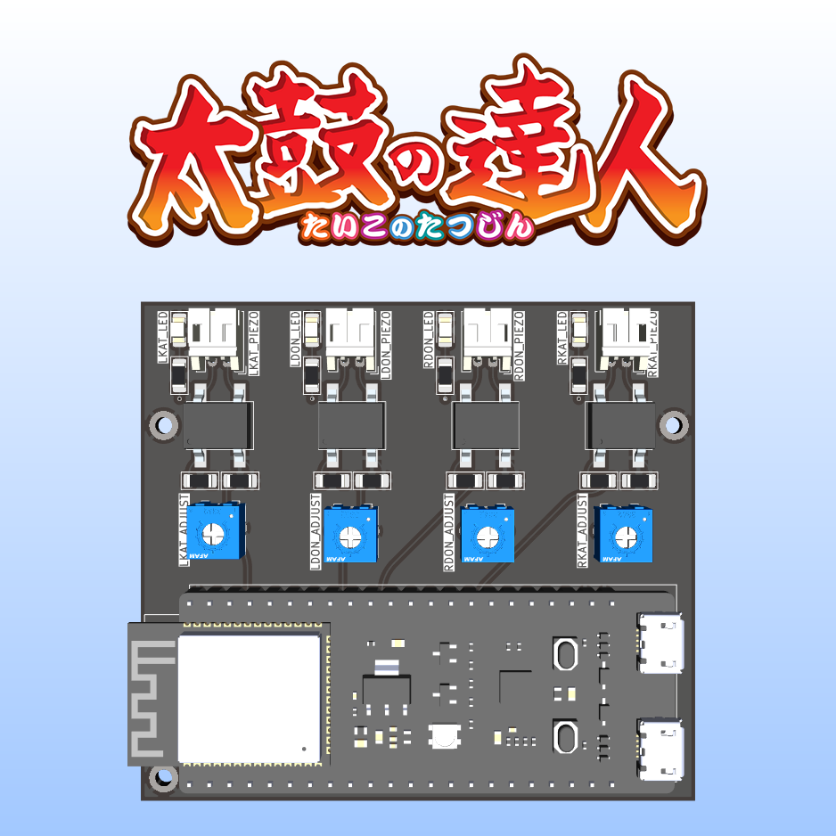
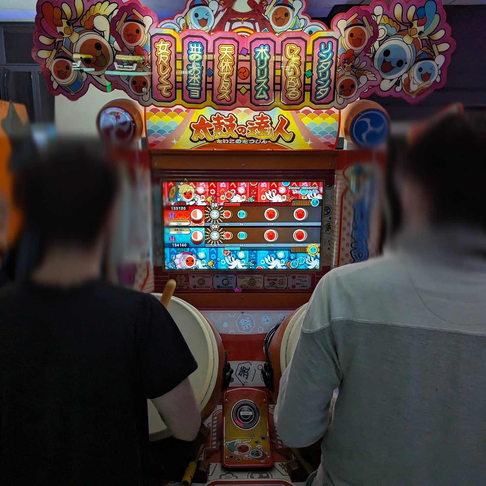
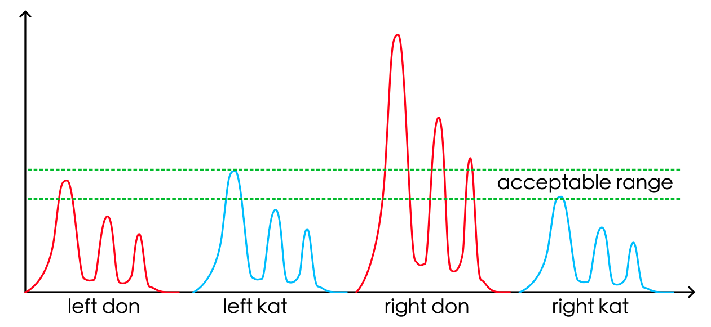
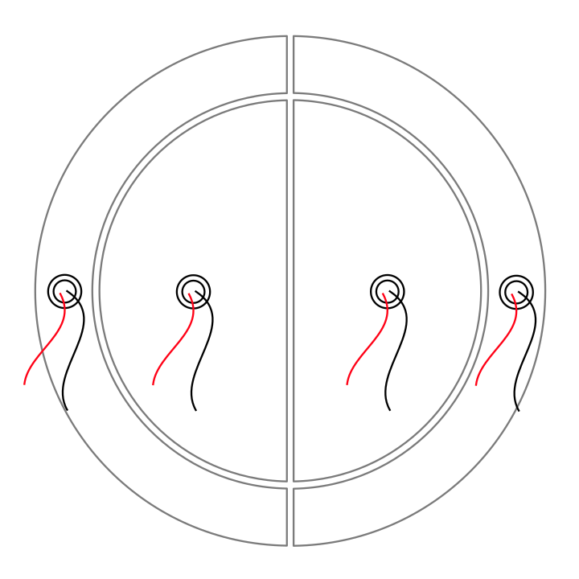
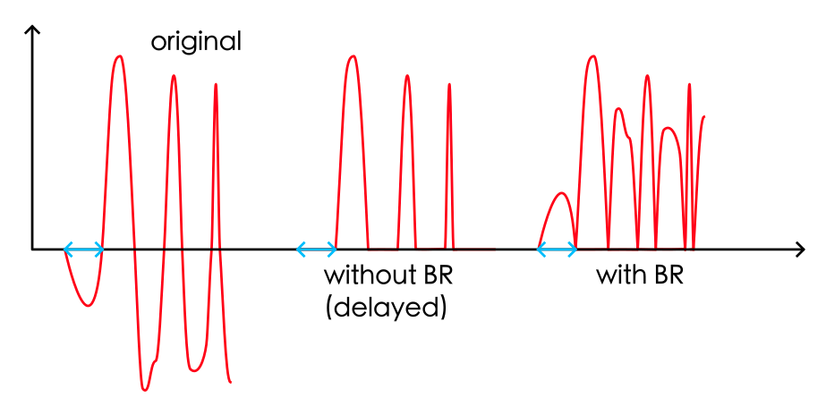

# Analog Taiko IO Board - ESP32 S3 DevkitC1

Open-source project to make your own Taiko no Tatsujin IO Board for PC use or SD cabs converted to Nijiiro.  
It emulates an analog joystick to enable force sensing, just like how you would play on an official arcade machine.



## About this Project

This is a hard fork of [ShikyC's](https://github.com/ShikyC/Taiko-Drum-Controller-Arduino) taiko controller project with some QOL improvements.
It's aim is to provide accurate-enough arcade drum support for converted SD cabs or bootlegs running Taiko Nijiiro.

**This program is for personal and non-commercial use only.**

## What You Need

* An [ESP32 S3 DevKitC-1](https://docs.espressif.com/projects/esp-idf/en/stable/esp32s3/hw-reference/esp32s3/user-guide-devkitc-1.html) board.
* 4 [JST PH 2.0](https://fr.aliexpress.com/item/1005004067623293.html) connectors (i'm using 90° ones but straight ones work too).
* 4 [1206 LEDs](https://fr.aliexpress.com/item/1005005975741298.html) (2 Blue and 2 Red).
* 8 1206 100kΩ resistors.
* 4 bridge rectifier chips. This project uses [DB107S](https://www.rectron.com/public/product_datasheets/db101s-db107s.pdf) (see the Additional Notes section for details).
* 4 10k variable resistors. This project uses [3362P-1-103](https://www.mouser.fr/datasheet/2/54/3362-776956.pdf)

All of those parts can be found for next to nothing on aliexpress.

You'll also need an IO Board PCB (you can find the gerber files in [here](PCB/Export/)).
I've used [JLCPCB](https://jlcpcb.com/) to order mine.

## Tuning the Parameters

All the parameters are located in [params.h](Firmware/params.h).

### Player Select

   By setting `#define PLAYER_SELECT` to either `1` or `2`, you can set what player the board will act as. If you're using two of these, make sure that they each are set to a different player to avoid issues.

   The buildin led of the ESP32 S3 DevKitC1 will be either red or blue depending on that value !

### Sensitivities

   Not all piezoelectric sensors are the same, and thus the captured signals from the 4 sensors may vary significantly. The sensitivity adjust trims are used to normalize those differences.  

   To facilitate setting those trims up, set `DEBUG` to `1`, flash the firmware, roll on one of the 4 areas of the drum, and visualize the graph from the output of the Serial Plotter.

   In the following example, the right-don area generates a much higher value than other 3, so you can adjust the `sensitivity` by turning the R_DON potentiometer to eliminate the issue.

   

   Note that the installation of the sensors is critical. You should make sure that the sensors are firmly attached on the wood and located properly, as seen on the picture below.

   

## Additional Notes

### Why using bridge rectifiers

   Without biasing the voltage of the piezoelectric sensors, their output voltage range is about -5V to +5V. However, the ESP32 ADCs only accept positive voltage values from 0 to 3.3V. When they receive a negative voltage, it's simply truncated to 0.

   In a taiko drum, all the 4 vibrating pieces are connected together, meaning that if you hit left-don, the processor also receives signals from left-kat, right-don, and right-kat. If the left-don piezoelectric sensor generates a negative voltage at the beginning and is truncated by the ADC, it will cause a minor "delay" of about 3 to 4 milliseconds, and the processor could incorrectly treat this hit as a right-don, a left-kat, or even a right-kat, whichever sends a highest positive value.

   Using a bridge rectifier, all negative values are converted to positive. In other words, it's acting like a mathematical `abs()` function, ensuring that we don't miss any negative voltages.

   

### TaikoArcadeLoader

You'll need to use a recent version of esuo1198's fork of [TaikoArcadeLoader](https://github.com/esuo1198/TaikoArcadeLoader) (Commit [945e104](https://github.com/esuo1198/TaikoArcadeLoader/commit/945e104) and up).

Open `config.toml` and enable analog input like so :

```toml
   [controller]
   analog = true  
```

If the IO Board is detected but your game doesn't register any inputs, check in `gamecontrollerdb.txt` that you have the following entry under `#Windows`:

`030052a8694800006948000000000000,Nijiiro Analog IO Board,-leftx:-a0,+leftx:+a0,-lefty:-a1,+lefty:+a1,-rightx:-a2,+rightx:+a2,-righty:-a3,+righty:+a3,platform:Windows,`
